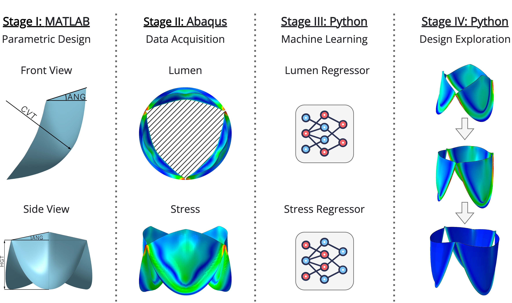

# Generative design with ML, modeling, and optimization
In this study, we propose a generative design approach that uses machine learning methods and optimization algorithms to create and optimize the geometry of medical devices. By combining these techniques, we aim to overcome the limitations of traditional methods such as [computer-aided design](https://en.wikipedia.org/wiki/Computer-aided_design) ([CAD](https://en.wikipedia.org/wiki/Computer-aided_design)) and [finite element method](https://en.wikipedia.org/wiki/Finite_element_method) ([FEM](https://en.wikipedia.org/wiki/Finite_element_method)), which are limited in the number of geometries that can be investigated and the time required for design optimization. We evaluated eight different machine learning methods, including decision tree-based methods, neural networks, boosting algorithms, and ensembles. In addition, we investigated six state-of-the-art optimization algorithms, including:
1. [x] [Random Search](https://www.jmlr.org/papers/v13/bergstra12a.html)
2. [x] [Tree-structured Parzen Estimator](https://papers.nips.cc/paper/2011/hash/86e8f7ab32cfd12577bc2619bc635690-Abstract.html)
3. [x] [CMA-ES-based Algorithm](https://arxiv.org/abs/1604.00772)
4. [x] [Nondominated Sorting Genetic Algorithm](https://ieeexplore.ieee.org/document/996017)
5. [x] [Multiobjective Tree-structured Parzen Estimator](https://www.jair.org/index.php/jair/article/view/13188)
6. [x] [Quasi-Monte Carlo Algorithm](https://www.jmlr.org/papers/v13/bergstra12a.html)

The proposed approach was applied to the generative design of a [prosthetic heart valve](https://en.wikipedia.org/wiki/Artificial_heart_valve) ([PHV](https://en.wikipedia.org/wiki/Artificial_heart_valve)), taking into account design constraints such as spatial requirements, materials, and manufacturing methods. The final design and corresponding score were then output, with a conclusion as to whether the design was effective. This approach aims to select the most efficient geometry with given input parameters, which can then be prototyped and used in subsequent _in vitro_ experiments.

## ℹ️ Overview
The proposed approach is chosen because it allows for a more thorough exploration of different geometric possibilities and can significantly reduce the time required for design optimization. The eight different ML methods we evaluated provide a diverse set of techniques for generating potential designs. The six state-of-the-art optimization algorithms we investigated allow for further optimization and selection of the most efficient geometry for given input parameters. By using a combination of different ML methods and optimization algorithms, we aimed to increase the chances of finding the best design within the given constraints and to improve the design process.

The proposed approach steps consist of:
* Implementing a parametric valve design
* Acquire initial [PHV](https://en.wikipedia.org/wiki/Artificial_heart_valve) designs using [FEM](https://en.wikipedia.org/wiki/Finite_element_method)
* Training and validating ML models using the [AutoML](https://en.wikipedia.org/wiki/Automated_machine_learning) methodology
* Search for optimal designs using an optimization algorithm
* Test the generated [PHV](https://en.wikipedia.org/wiki/Artificial_heart_valve) designs using finite element modeling

  

    Figure 1. Overview of the proposed multistage generative approach

