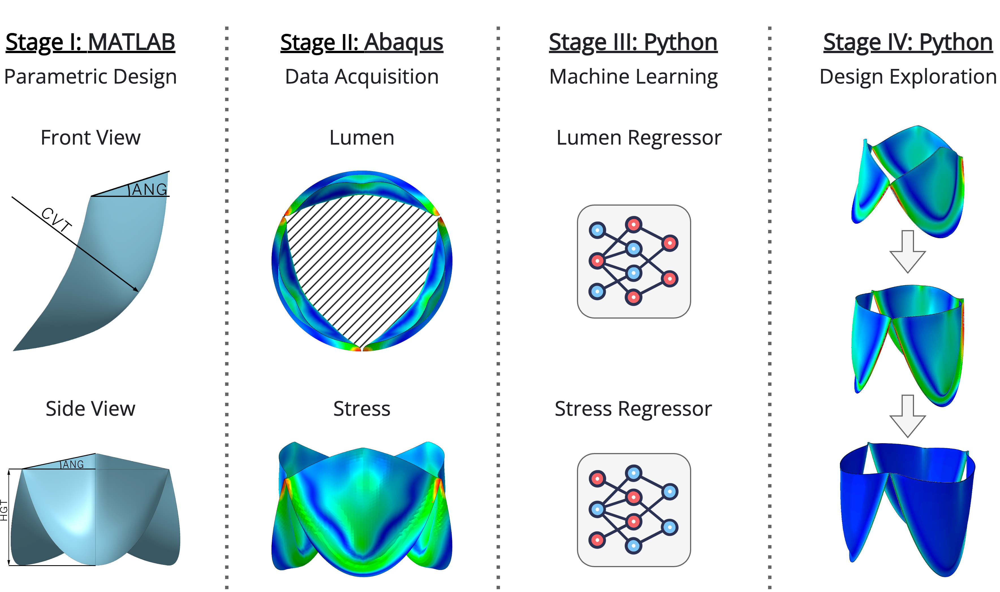

[](https://doi.org/10.5281/zenodo.10865908)
[](https://doi.org/10.3389/fbioe.2023.1238130)

# Generative design with ML, modeling, and optimization

<a name="contents"></a>
## 📖 Contents
- [Purpose](#purpose)
- [Data](#data)
- [Methods](#methods)
- [Results](#results)
- [Conclusion](#conclusion)
- [Requirements](#requirements)
- [Installation](#installation)
- [Data Access](#data-access)
- [How to Cite](#how-to-cite)

<a name="purpose"></a>
## 🎯 Purpose
This study proposes a novel method for designing prosthetic heart valves (PHVs) by combining machine learning (ML) with optimization algorithms. This approach aims to overcome the limitations of traditional design methods, such as [Computer-Aided Design](https://en.wikipedia.org/wiki/Computer-aided_design) (CAD) and [Finite Element Method](https://en.wikipedia.org/wiki/Finite_element_method) (FEM), by automating the exploration of the vast design space, enabling the rapid development of PHVs that are potentially more effective and durable.

<a name="data"></a>
## 📁 Data
Our dataset comprises 11,565 unique PHV designs, meticulously generated through parametric modeling. Each design variant is defined by a set of six key parameters: _height (HGT)_, _diameter (DIA)_, _leaflet thickness (THK)_, _curvature (CVT)_, _elevation angle (ANG)_, and _material stiffness (Young’s modulus, ELM)_. These parameters were systematically varied (<a href="#figure-1">Figure 1</a>) within realistic ranges to simulate a wide array of possible PHV configurations. For each design, FEM was performed to simulate its behavior under typical physiological conditions, focusing on two critical performance metrics: the _opening area (LMN)_ and _peak stress (STS)_ on the leaflets. This comprehensive dataset serves as the foundation for our machine learning models, capturing the complex interplay between design parameters and PHV performance.

<p align="center">
  
</p>

<p align="center">
    <em><strong>Figure 1.</strong> Distribution of input variables and output targets</em>
</p>

<a name="methods"></a>
## 🔬 Methods

Our approach evaluates a combination of eight machine learning techniques—including decision trees, neural networks, boosting algorithms, and ensembles—and six state-of-the-art optimization algorithms to generate and refine the geometry of medical devices. This comprehensive methodological framework is applied to the generative design of prosthetic heart valves (PHVs), considering critical design constraints like spatial requirements, material properties, and manufacturability. The optimization algorithms employed include Random Search, Tree-structured Parzen Estimator, CMA-ES-based Algorithm, Nondominated Sorting Genetic Algorithm, Multiobjective Tree-structured Parzen Estimator, and Quasi-Monte Carlo Algorithm.

<a name="results"></a>
## 📈 Results

The optimization process demonstrated the efficacy of the algorithms in selecting optimal design parameters that ensure efficient leaflet opening and minimal stress on the PHVs. The qualitative analysis showed that the algorithms could consistently identify designs with high opening areas while keeping stress levels below the material strength limit. Notably, all algorithms exhibited similar trends in optimizing the geometric indicators, indicating their reliability in identifying effective designs.

<a name="conclusion"></a>
## 🏁 Conclusion

Our generative design approach offers a significant advancement in the development of medical devices, especially prosthetic heart valves. By harnessing the power of machine learning and optimization algorithms, we can explore a wider array of geometric possibilities and achieve optimal designs more efficiently than traditional methods.

<a name="requirements"></a>
## 💻 Requirements

- Python 3.8.x
- DVC for data version control
  - `dvc==2.41.1`
  - `dvc-gdrive==2.19.2`
- Operating Systems Supported:
  - [x] macOS
  - [x] Linux
  - [x] Windows

<a name="installation"></a>
## ⚙ Installation

# OLD

# Generative design with ML, modeling, and optimization
In this study, we propose a generative design approach that uses machine learning methods and optimization algorithms to create and optimize the geometry of medical devices. By combining these techniques, we aim to overcome the limitations of traditional methods such as [computer-aided design](https://en.wikipedia.org/wiki/Computer-aided_design) ([CAD](https://en.wikipedia.org/wiki/Computer-aided_design)) and [finite element method](https://en.wikipedia.org/wiki/Finite_element_method) ([FEM](https://en.wikipedia.org/wiki/Finite_element_method)), which are limited in the number of geometries that can be investigated and the time required for design optimization. We evaluated eight different machine learning methods, including decision tree-based methods, neural networks, boosting algorithms, and ensembles. In addition, we investigated six state-of-the-art optimization algorithms, including:
1. [x] [Random Search](https://www.jmlr.org/papers/v13/bergstra12a.html)
2. [x] [Tree-structured Parzen Estimator](https://papers.nips.cc/paper/2011/hash/86e8f7ab32cfd12577bc2619bc635690-Abstract.html)
3. [x] [CMA-ES-based Algorithm](https://arxiv.org/abs/1604.00772)
4. [x] [Nondominated Sorting Genetic Algorithm](https://ieeexplore.ieee.org/document/996017)
5. [x] [Multiobjective Tree-structured Parzen Estimator](https://www.jair.org/index.php/jair/article/view/13188)
6. [x] [Quasi-Monte Carlo Algorithm](https://www.jmlr.org/papers/v13/bergstra12a.html)

The proposed approach was applied to the generative design of a [prosthetic heart valve](https://en.wikipedia.org/wiki/Artificial_heart_valve) ([PHV](https://en.wikipedia.org/wiki/Artificial_heart_valve)), taking into account design constraints such as spatial requirements, materials, and manufacturing methods. The final design and corresponding score were then output, with a conclusion as to whether the design was effective. This approach aims to select the most efficient geometry with given input parameters, which can then be prototyped and used in subsequent _in vitro_ experiments.

## ℹ️ Overview
The proposed approach is chosen because it allows for a more thorough exploration of different geometric possibilities and can significantly reduce the time required for design optimization. The eight different ML methods we evaluated provide a diverse set of techniques for generating potential designs. The six state-of-the-art optimization algorithms we investigated allow for further optimization and selection of the most efficient geometry for given input parameters. By using a combination of different ML methods and optimization algorithms, we aimed to increase the chances of finding the best design within the given constraints and to improve the design process.

The proposed approach steps consist of:
* Implementing a parametric valve design
* Acquire initial [PHV](https://en.wikipedia.org/wiki/Artificial_heart_valve) designs using [FEM](https://en.wikipedia.org/wiki/Finite_element_method)
* Training and validating ML models using the [AutoML](https://en.wikipedia.org/wiki/Automated_machine_learning) methodology
* Search for optimal designs using an optimization algorithm
* Test the generated [PHV](https://en.wikipedia.org/wiki/Artificial_heart_valve) designs using finite element modeling

<p align="center">
  
</p>

<p align="center">
    Figure 1. Overview of the proposed multistage generative approach.
</p>

## ℹ️ Results
A qualitative examination of the optimization results confirms the efficiency of the algorithms. All algorithms effectively selected parameter combinations that resulted in optimal leaflet opening while minimizing stress, as demonstrated in Figure 2. The optimal leaflet models typically exhibit high opening areas while maintaining moderate stress values, which in most cases do not exceed 2.0 MPa. This is well below the strength limit of the material models. It is noteworthy that the optimization algorithms show similar trends in selecting the best geometric indicators.

<p align="center">
  
</p>

<p align="center">
    Figure 2. Examples of final designs resulting from the studied optimizers: epiphyses in the open state after pressure application simulation. The initial geometry from which all algorithms started optimization is also presented.
</p>

The [**valve opening directory**](https://github.com/ViacheslavDanilov/generative_design/tree/main/media/valve_opening) provides a set of valves generated by all optimization algorithms, with the valve presented below being specifically generated by the Quasi-Monte Carlo algorithm.

https://user-images.githubusercontent.com/32963687/218339366-ecd354f0-4612-4097-8f01-6c0774b9d044.mp4

## ℹ️ Dataset and Models

1. To download the dataset and models, clone the repository:
``` bash
git clone https://github.com/ViacheslavDanilov/generative_design.git
```

2. Install DVC:
``` bash
pip install dvc==2.41.1 dvc-gdrive==2.19.2
```

3. Download the dataset and models using the following commands:

|                                           Artifact                                            |                                                            Description                                                             |  Size   |                                              Command                                               |
|:---------------------------------------------------------------------------------------------:|:----------------------------------------------------------------------------------------------------------------------------------:|:-------:|:--------------------------------------------------------------------------------------------------:|
| [Dataset](https://github.com/ViacheslavDanilov/generative_design/blob/main/dataset/data.xlsx) |                        Dataset of 11565 [PHV](https://en.wikipedia.org/wiki/Artificial_heart_valve) designs                        | 2.7 Mb  | [Download link](https://github.com/ViacheslavDanilov/generative_design/raw/main/dataset/data.xlsx) |
| [LMN model](https://github.com/ViacheslavDanilov/generative_design/blob/main/models/LMN.dvc)  |   Single-output ML ensemble predicting **maximum opening area** of a [PHV](https://en.wikipedia.org/wiki/Artificial_heart_valve)   | 1.55 Gb |                                   ```dvc pull models/LMN.dvc```                                    |
| [STS model](https://github.com/ViacheslavDanilov/generative_design/blob/main/models/STS.dvc)  | Single-output ML ensemble predicting **maximum principal stress** of a [PHV](https://en.wikipedia.org/wiki/Artificial_heart_valve) | 1.85 Gb |                                   ```dvc pull models/STS.dvc```                                    |

NOTE: Since the data storage is organized through Google Drive, you may experience errors when downloading models. If you encounter problems downloading models, please contact [Viacheslav Danilov](https://github.com/ViacheslavDanilov) at <a href="mailto:viacheslav.v.danilov@gmail.com">viacheslav.v.danilov@gmail.com</a> to gain access to the DVC repository.
