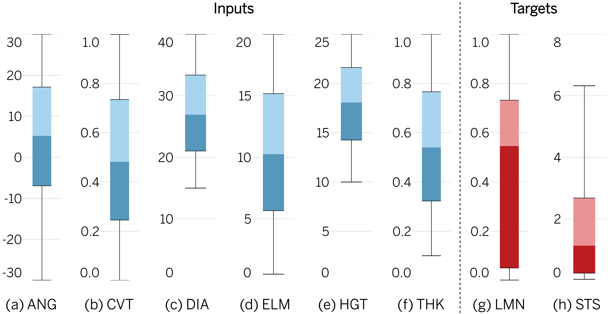
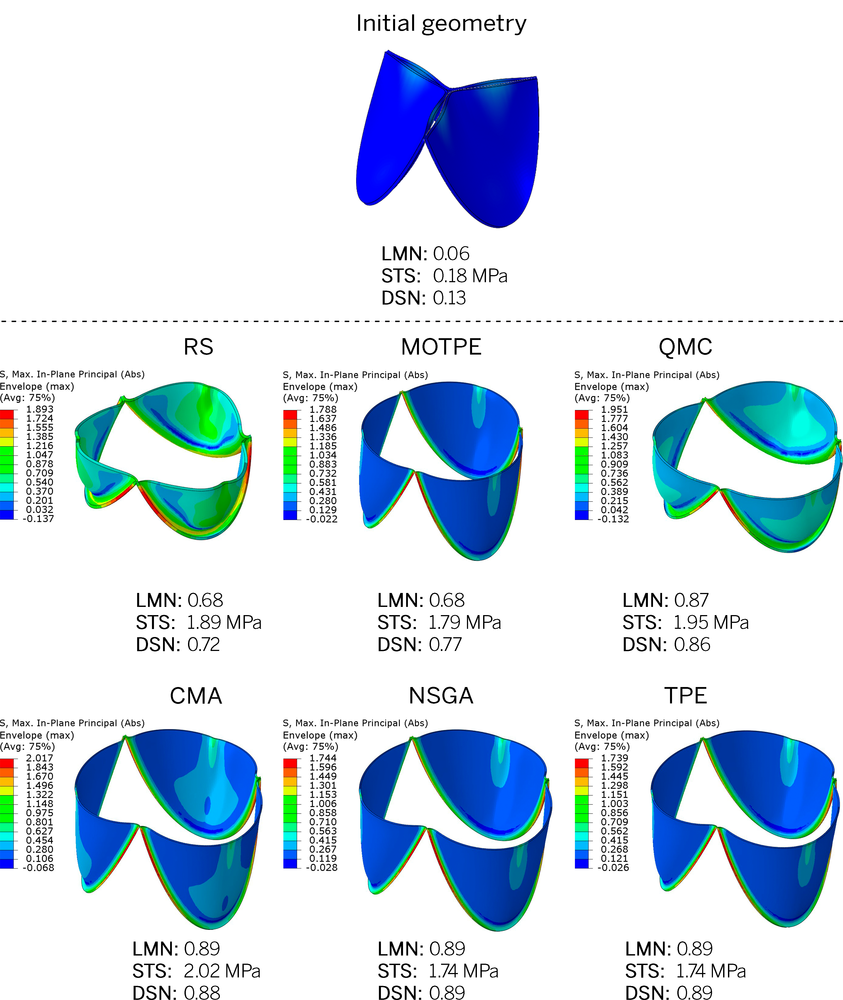

# Perfect prosthetic heart valve: generative design with machine learning, modeling, and optimization

## 📖 Contents
- [Purpose](#purpose)
- [Data](#data)
- [Methods](#methods)
  - [Parametric Design and Finite Element Analysis](#parametric-design)
  - [Machine Learning Models](#ml-models)
  - [Optimization Algorithms](#optimization-algorithms)
- [Results](#results)
- [Conclusion](#conclusion)
- [Requirements](#requirements)
- [Installation](#installation)
- [Data Access](#data-access)
- [How to Cite](#how-to-cite)

## 🎯 Purpose
This study proposes a novel method for designing prosthetic heart valves (PHVs) by combining machine learning (ML) with optimization algorithms. This approach aims to overcome the limitations of traditional design methods, such as [Computer-Aided Design](https://en.wikipedia.org/wiki/Computer-aided_design) (CAD) and [Finite Element Method](https://en.wikipedia.org/wiki/Finite_element_method) (FEM), by automating the exploration of the vast design space, enabling the rapid development of PHVs that are potentially more effective and durable.

## 📁 Data
Our dataset comprises 11,565 unique PHV designs, meticulously generated through parametric modeling. Each design variant is defined by a set of six key parameters: _height (HGT)_, _diameter (DIA)_, _leaflet thickness (THK)_, _curvature (CVT)_, _elevation angle (ANG)_, and _material stiffness (Young’s modulus, ELM)_. These parameters were systematically varied (<a href="#figure-1">Figure 1</a>) within realistic ranges to simulate a wide array of possible PHV configurations. For each design, FEM was performed to simulate its behavior under typical physiological conditions, focusing on two critical performance metrics: the _opening area (LMN)_ and _peak stress (STS)_ on the leaflets. This comprehensive dataset serves as the foundation for our machine learning models, capturing the complex interplay between design parameters and PHV performance.

  

    <em><strong>Figure 1.</strong> Distribution of input variables and output targets.</em>

## 🔬 Methods

### Parametric Design and Finite Element Analysis
Initially, PHV designs were generated using MATLAB, varying the six key parameters within predefined ranges. These designs were then analyzed using "Abaqus/CAE" to simulate their mechanical behavior under physiological pressures. The simulation results provided us with LMN and STS values for each design.

### Machine Learning Models
With the dataset in hand, we explored a variety of machine learning algorithms, focusing particularly on ensemble methods due to their robustness and accuracy. The dataset was split into training and validation sets, with 80% for training and 20% for validation. We evaluated the performance of decision trees, random forests, gradient boosting machines (including XGBoost, LightGBM, and CatBoost), and neural networks, ultimately focusing on ensemble models that combined the strengths of multiple algorithms.

### Optimization Algorithms
For the optimization phase, we employed six state-of-the-art algorithms: [Random Search](https://www.jmlr.org/papers/v13/bergstra12a.html) (RS), [Tree-structured Parzen Estimator](https://papers.nips.cc/paper/2011/hash/86e8f7ab32cfd12577bc2619bc635690-Abstract.html) (TPE), [CMA-ES-based Algorithm](https://arxiv.org/abs/1604.00772) (CMA), [Nondominated Sorting Genetic Algorithm](https://ieeexplore.ieee.org/document/996017) (NSGA), [Multiobjective Tree-structured Parzen Estimator](https://www.jair.org/index.php/jair/article/view/13188) (MTPE), [Quasi-Monte Carlo Algorithm](https://www.jmlr.org/papers/v13/bergstra12a.html) (QMC). Each algorithm was tasked with finding the optimal set of design parameters that maximized the opening area while minimizing the peak stress, iterating through 2,000 design simulations per algorithm.

## 📈 Results
Our ensemble ML models achieved notable accuracy, with Mean Absolute Percentage Errors of 11.8% for the lumen opening and 10.2% for peak stress predictions (<a href="#table-1">Table 1</a>). This precision underscores the potential of ML models to predict PHV performance based on design parameters.

In the optimization phase, TPE and NSGA emerged as the most effective algorithms, efficiently navigating the design space to identify configurations that balanced the opening area and stress distribution. Designs optimized by these algorithms achieved design scores of approximately 95%, indicating a high degree of efficacy in meeting the established performance criteria.

<i><strong id="table-1">Table 1.</strong> Evaluation of model performance on training and validation subsets.</i>

| **№** | **Metric** | **LMN train** | **LMN val** | **STS train** | **STS val** |
|:-----:|:----------:|:-------------:|-------------|:-------------:|:-----------:|
|   1   |    MAPE    |     0.116     | 0.118       |     0.093     |    0.102    |
|   2   |    WAPE    |     0.042     | 0.044       |     0.077     |    0.081    |
|   3   |    MAE     |     0.018     | 0.019       |     0.127     |    0.135    |
|   4   |   NRMSE    |     0.040     | 0.044       |     0.022     |    0.029    |
|   5   |    R^2     |     98.7%     | 98.4%       |     97.0%     |    96.8%    |

A qualitative examination of the optimization results confirms the efficiency of the algorithms. All algorithms effectively selected parameter combinations that resulted in optimal leaflet opening while minimizing stress, as demonstrated in <a href="#figure-2">Figure 2</a>. The optimal leaflet models typically exhibit high opening areas while maintaining moderate stress values, which in most cases do not exceed 2.0 MPa. This is well below the strength limit of the material models. It is noteworthy that the optimization algorithms show similar trends in selecting the best geometric indicators.

The [**valve opening directory**](https://github.com/ViacheslavDanilov/generative_design/tree/main/media/valve_opening) provides a set of valves generated by all optimization algorithms, with the valve presented below being specifically generated by the Quasi-Monte Carlo algorithm.

  

    <em><strong>Figure 2.</strong> Examples of final designs resulting from the studied optimizers: epiphyses in the open state after pressure application simulation. The initial geometry from which all algorithms started optimization is also presented.</em>

https://user-images.githubusercontent.com/32963687/218339366-ecd354f0-4612-4097-8f01-6c0774b9d044.mp4

## 🏁 Conclusion

Our generative design approach offers a significant advancement in the development of medical devices, especially prosthetic heart valves. By harnessing the power of machine learning and optimization algorithms, we can explore a wider array of geometric possibilities and achieve optimal designs more efficiently than traditional methods.

## 💻 Requirements
- Operating System
  - [x] macOS
  - [x] Linux
  - [x] Windows (limited testing carried out)
- Python 3.8.x
- Required core packages: [requirements.txt](https://github.com/ViacheslavDanilov/generative_design/blob/main/requirements.txt)

## ⚙ Installation

## 🔐 Data Access
All essential components of the study, including the curated dataset and trained models, have been made publicly available:
- Dataset: [https://github.com/ViacheslavDanilov/generative_design/raw/main/dataset/data.xlsx](https://github.com/ViacheslavDanilov/generative_design/raw/main/dataset/data.xlsx).
- Models: [https://zenodo.org/doi/10.5281/zenodo.10865907](https://zenodo.org/doi/10.5281/zenodo.10865907).

## 🖊️ How to Cite
Please cite [our paper](https://doi.org/10.3389/fbioe.2023.1238130) if you found our data, methods, or results helpful for your research:

> Danilov V.V., Klyshnikov K.Y., Onishenko P.S., Proutski A., Gankin Y., Melgani F., Ovcharenko E.A. (**2023**). _Perfect prosthetic heart valve: generative design with machine learning, modeling, and optimization_. **Frontiers in Bioengineering and Biotechnology**. DOI: [https://doi.org/10.3389/fbioe.2023.1238130](https://doi.org/10.3389/fbioe.2023.1238130)
